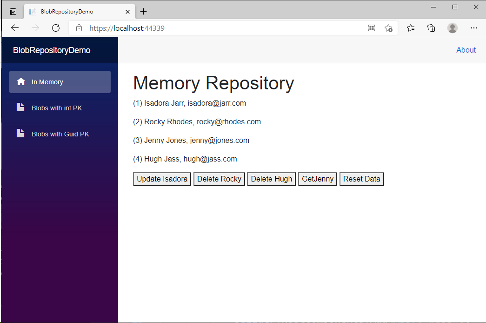
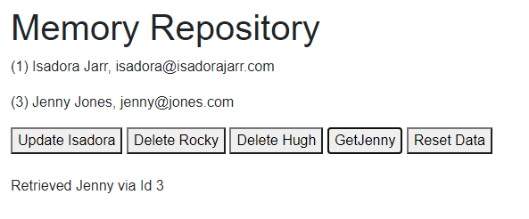

# Using JSON files in Azure Blob Storage as a data store in a Blazor WebAssembly app

## This repo holds the sample app built in [episode 47](https://youtu.be/IZsHbDrWP68) of [BlazorTrain](https://blazortrain.com/), which aired May 14, 2021

## The Use Case

The first question you must ask yourself is, "why blob storage?" After all, there are plenty of real database options available on Azure or any other public cloud provider. 

Here are the criteria, as I see it, for this use case:

- Small amount of data (< 5MB)
- Infrequent writes
- Frequent reads

The amount of data is important. Every change that's made has to completely overwrite a JSON file. The more data, the longer it takes to update.

The more frequently you overwrite the data, the slower the system will be overall.

As for reading, you can keep the data in memory and only refresh after x amount of minutes have elapsed, or after a write operation.

So, if you have lots of data or frequent writes, this is not the architecture for you.

That said, this repo also includes a reference architecture for how to build an API Layer for a Blazor WebAssembly application using the IRepository pattern everywhere, and generics wherever possible.

## Step 1. Create a Blazor WebAssembly App

In my demo, I use Visual Studio to create a *hosted* Blazor WebAssembly application called *BlobRepositoryDemo*. This will create three projects: *BlobRepositoryDemo.Client*, *BlobRepositoryDemo.Server*, and *BlobRepositoryDemo.Shared*.

## Step 2. Add Models

To the *Shared* app, add a *Models* folder and add the following files to it:

*Customer.cs*

```c#
using System;
using System.Collections.Generic;
using System.Linq;
using System.Text;
using System.Threading.Tasks;

namespace BlobRepositoryDemo.Shared.Models
{
    public class Customer
    {
        public int Id { get; set; }
        public string Name { get; set; } = "";
        public string Email { get; set; } = "";
    }
}
```

`Customer` will serve as our primary demo model. Note that the `Id` property is defined as an `int`. 

*APIEntityResponse.cs*

```c#
using System;
using System.Collections.Generic;
using System.Text;

namespace BlobRepositoryDemo.Shared.Models
{
    public class APIEntityResponse<TEntity> where TEntity : class
    {
        public bool Success { get; set; }
        public List<string> ErrorMessages { get; set; } = new List<string>();
        public TEntity Data { get; set; }
    }
}
```

*APIListOfEntityResponse.cs*

```c#
using System;
using System.Collections.Generic;
using System.Text;

namespace BlobRepositoryDemo.Shared.Models
{
    public class APIListOfEntityResponse<TEntity> where TEntity : class
    {
        public bool Success { get; set; }
        public List<string> ErrorMessages { get; set; } = new List<string>();
        public IEnumerable<TEntity> Data { get; set; }
    }
}
```

These two classes will be used as return types for our API controllers to add a little context to the actual entities returned.

*IRepository.cs*

```c#
using System;
using System.Collections.Generic;
using System.Linq;
using System.Linq.Expressions;
using System.Text;
using System.Threading.Tasks;

namespace BlobRepositoryDemo.Shared.Models
{
    public interface IRepository<TEntity> where TEntity : class 
    {
        Task<bool> Delete(TEntity EntityToDelete);
        Task<bool> Delete(object Id);
        Task DeleteAll(); // Be Careful!!!
        Task<IEnumerable<TEntity>> Get(
            Expression<Func<TEntity, bool>> Filter = null,
            Func<IQueryable<TEntity>, IOrderedQueryable<TEntity>> OrderBy = null,
            string IncludeProperties = "");
        Task<IEnumerable<TEntity>> GetAll();
        Task<TEntity> GetById(object Id);
        Task<TEntity> Insert(TEntity Entity);
        Task<TEntity> Update(TEntity EntityToUpdate);
    }
}
```

The `IRepository<TEntity>` interface  will be used on the server as well as the client to ensure compatibility accessing data, no matter where the code resides.

Note the `Get` method, which has all kinds of LINQ fairy dust sprinkled on it. This is so we can make queries into the data without having to add new methods. For example, you could search a customer by name simply by calling Get with a filter like so:

```c#
string searchTerm = "Franklin";
await MyDataManager.Get(x => x.Name.ToLower().Contains(searchTerm.ToLower()));
```


## Step 3. Add a Data Manager to the Server app

To the server project, add a *Data* folder, and add this class to it:

*MemoryDataManager.cs*

```c#
using BlobRepositoryDemo.Shared.Models;
using System;
using System.Collections.Generic;
using System.Linq;
using System.Linq.Expressions;
using System.Reflection;
using System.Threading.Tasks;

namespace BlobRepositoryDemo.Server.Data
{
    public class MemoryDataManager<TEntity> : IRepository<TEntity> where TEntity : class
    {
        private List<TEntity> Data;
        private PropertyInfo IdProperty = null;
        private string IdPropertyName = "";

        public MemoryDataManager(string idPropertyName)
        {
            IdPropertyName = idPropertyName;
            Data = new List<TEntity>();
            IdProperty = typeof(TEntity).GetProperty(idPropertyName);
        }

        public async Task<bool> Delete(TEntity EntityToDelete)
        {
            if (EntityToDelete == null) return false;

            await Task.Delay(0);
            try
            {
                if (Data.Contains(EntityToDelete))
                {
                    Data.Remove(EntityToDelete);
                    return true;
                }
            }
            catch { }
            return false;
        }

        public async Task<bool> Delete(object Id)
        {
            try
            {
                var EntityToDelete = await GetById(Id);
                return await Delete(EntityToDelete);

            }
            catch { }
            return false;
        }

        public async Task DeleteAll()
        {
            await Task.Delay(0);
            Data.Clear();
        }

        public async Task<IEnumerable<TEntity>> Get(Expression<Func<TEntity, bool>> 
           filter = null, Func<IQueryable<TEntity>, 
           IOrderedQueryable<TEntity>> orderBy = null, 
           string includeProperties = "")
        {
            return await Task.Run(() =>
            {
                try
                {
                    // Get the dbSet from the Entity passed in                
                    IQueryable<TEntity> query = Data.AsQueryable<TEntity>();

                    // Apply the filter
                    if (filter != null)
                    {
                        query = query.Where(filter);
                    }

                    // Sort
                    if (orderBy != null)
                    {
                        return orderBy(query).ToList();
                    }
                    else
                    {
                        return query.ToList();
                    }
                }
                catch (Exception ex)
                {
                    var msg = ex.Message;
                    return null;
                }
            });
        }

        public async Task<IEnumerable<TEntity>> GetAll()
        {
            await Task.Delay(0);
            return Data;
        }

        public async Task<TEntity> GetById(object Id)
        {
            await Task.Delay(0);
            if (IdProperty == null) return default(TEntity);
            TEntity entity = null;
            if (IdProperty.PropertyType.IsValueType)
            {
                entity = (from x in Data 
                          where IdProperty.GetValue(x).ToString() == Id.ToString() 
                          select x).FirstOrDefault();
            }
            else
            {
                entity = (from x in Data 
                          where IdProperty.GetValue(x) == Id 
                          select x).FirstOrDefault();
            }
            return entity;
        }

        public async Task<TEntity> Insert(TEntity Entity)
        {
            await Task.Delay(0);
            if (Entity == null) return default(TEntity);
            try
            {
                Data.Add(Entity);
                return Entity;
            }
            catch { }
            return default(TEntity);
        }

        public async Task<TEntity> Update(TEntity EntityToUpdate)
        {
            await Task.Delay(0);
            if (EntityToUpdate == null) return default(TEntity);
            if (IdProperty == null) return default(TEntity);
            try
            {
                var id = IdProperty.GetValue(EntityToUpdate);
                var entity = await GetById(id);
                if (entity != null)
                {
                    var index = Data.IndexOf(entity);
                    Data[index] = EntityToUpdate;
                    return EntityToUpdate;
                }
                else
                    return default(TEntity);
            }
            catch { }
            return default(TEntity);
        }
    }
}
```

We're starting with a simple implementation of `IRepository<TEntity>` that simply stores data in memory. 

It is completely generic, meaning we can define one for any entity type. 

We're using a bit of Reflection to access the primary key property and get its value when we need to. Other than that, it's pretty straightforward. Take a moment to read through the code so you understand it.

## Step 4 - Add MemoryDataManager as a service in Startup

Add the following to the server project's *Startup.cs* file, in the `ConfigureServices` method:

```c#
            services.AddSingleton<MemoryDataManager<Customer>>(x =>
                new MemoryDataManager<Customer>("Id"));
```

You might be wondering why I didn't define it as `IRepository<Customer>`. The reason is so we can differentiate it from another implementation of `IRepository<Customer>` which we will be adding next.

We're adding it as a Singleton because we only want one instance on the server shared between all clients.

In the above code we're configuring this manager telling it that the primary key property of `Customer` is named "Id."

## Step 5 - Add an API Controller to the server project

To the server project's *Controllers* folder, add the following:

*InMemoryCustomersController.cs*

```c#
using BlobRepositoryDemo.Server.Data;
using BlobRepositoryDemo.Shared.Models;
using Microsoft.AspNetCore.Mvc;
using System;
using System.Collections.Generic;
using System.Linq;
using System.Threading.Tasks;

namespace BlobRepositoryDemo.Server.Controllers
{
    [Route("[controller]")]
    [ApiController]
    public class InMemoryCustomersController : ControllerBase
    {
        MemoryDataManager<Customer> customersManager;

        public InMemoryCustomersController(MemoryDataManager<Customer> _customersManager)
        {
            customersManager = _customersManager;
        }

        [HttpGet("deleteall")]
        public async Task<ActionResult> DeleteAll()
        {
            try
            {
                await customersManager.DeleteAll();
                return NoContent();
            }
            catch (Exception ex)
            {
                // log exception here
                return StatusCode(500);
            }
        }

        [HttpGet]
        public async Task<ActionResult<APIListOfEntityResponse<Customer>>> Get()
        {
            try
            {
                var result = await customersManager.Get();
                return Ok(new APIListOfEntityResponse<Customer>()
                {
                    Success = true,
                    Data = result
                });
            }
            catch (Exception ex)
            {
                // log exception here
                return StatusCode(500);
            }
        }

        [HttpGet("{Id}")]
        public async Task<ActionResult<APIEntityResponse<Customer>>> GetById(int Id)
        {
            try
            {
                var result = await customersManager.GetById(Id);
                if (result != null)
                {
                    return Ok(new APIEntityResponse<Customer>()
                    {
                        Success = true,
                        Data = result
                    });
                }
                else
                {
                    return Ok(new APIEntityResponse<Customer>()
                    {
                        Success = false,
                        ErrorMessages = new List<string>() { "Customer Not Found" },
                        Data = null
                    });
                }
            }
            catch (Exception ex)
            {
                // log exception here
                return StatusCode(500);
            }
        }

        [HttpPost]
        public async Task<ActionResult<APIEntityResponse<Customer>>> 
            Insert([FromBody] Customer Customer)
        {
            try
            {
                var result = await customersManager.Insert(Customer);
                if (result != null)
                {
                    return Ok(new APIEntityResponse<Customer>()
                    {
                        Success = true,
                        Data = result
                    });
                }
                else
                {
                    return Ok(new APIEntityResponse<Customer>()
                    {
                        Success = false,
                        ErrorMessages = new List<string>() 
                        	{ "Could not find customer after adding it." },
                        Data = null
                    });
                }
            }
            catch (Exception ex)
            {
                // log exception here
                return StatusCode(500);
            }
        }

        [HttpPut]
        public async Task<ActionResult<APIEntityResponse<Customer>>> 
            Update([FromBody] Customer Customer)
        {
            try
            {
                var result = await customersManager.Update(Customer);
                if (result != null)
                {
                    return Ok(new APIEntityResponse<Customer>()
                    {
                        Success = true,
                        Data = result
                    });
                }
                else
                {
                    return Ok(new APIEntityResponse<Customer>()
                    {
                        Success = false,
                        ErrorMessages = new List<string>() 
                        	{ "Could not find customer after updating it." },
                        Data = null
                    });
                }
            }
            catch (Exception ex)
            {
                // log exception here
                return StatusCode(500);
            }
        }

        [HttpDelete("{Id}")]
        public async Task<ActionResult<bool>> Delete(int Id)
        {
            try
            {
                return await customersManager.Delete(Id);
            }
            catch (Exception ex)
            {
                // log exception here
                var msg = ex.Message;
                return StatusCode(500);
            }
        }
    }
}
```

Because we added `MemoryDataManager<Customer>` as a singleton service, we can inject that right into our controller and use it to access the data store, in this case, an in-memory implementation of `IRepository<Customer>`

Note the use of `Task<ActionResult<T>>` in every endpoint. That's good practice. Also, any time we're returning an entity or list of entities we are wrapping the result in either `APIEntityResponse<T>` or `APIListOfEntityResponse<T>`. 

The filtered `Get()` method has the most complex return type:

```c#
Task<ActionResult<APIListOfEntityResponse<Customer>>>
```

## Step 6 - Add an APIRepository class to the Client

To the client app, add a *Services* folder and add the following:

*APIRepository.cs*

```c#
using System;
using System.Collections.Generic;
using System.Threading.Tasks;
using BlobRepositoryDemo.Shared.Models;
using System.Net.Http;
using System.Net.Http.Json;
using Newtonsoft.Json;
using System.Net;
using System.Linq.Expressions;
using System.Linq;
using System.Text;

namespace BlobRepositoryDemo.Client.Services
{
    /// <summary>
    /// Reusable API Repository base class that provides access to CRUD APIs
    /// </summary>
    /// <typeparam name="TEntity"></typeparam>
    public class APIRepository<TEntity> : IRepository<TEntity>
        where TEntity : class
    {
        string controllerName;
        string primaryKeyName;
        HttpClient http;

        public APIRepository(HttpClient _http, 
            string _controllerName, string _primaryKeyName)
        {
            http = _http;
            controllerName = _controllerName;
            primaryKeyName = _primaryKeyName;
        }


        public async Task<IEnumerable<TEntity>> GetAll()
        {
            try
            {
                var result = await http.GetAsync(controllerName);
                result.EnsureSuccessStatusCode();
                string responseBody = await result.Content.ReadAsStringAsync();
                var response = 
                    JsonConvert.DeserializeObject<APIListOfEntityResponse<TEntity>>
                    (responseBody);
                if (response.Success)
                    return response.Data;
                else
                    return new List<TEntity>();
            }
            catch (Exception ex)
            {
                return null;
            }
        }

        public async Task<TEntity> GetById(object id)
        {
            try
            {
                var arg = WebUtility.HtmlEncode(id.ToString());
                var url = controllerName + "/" + arg;
                var result = await http.GetAsync(url);
                result.EnsureSuccessStatusCode();
                string responseBody = await result.Content.ReadAsStringAsync();
                var response = JsonConvert.DeserializeObject<APIEntityResponse<TEntity>>
                    (responseBody);
                if (response.Success)
                    return response.Data;
                else
                    return null;
            }
            catch (Exception ex)
            {
                var msg = ex.Message;
                return null;
            }
        }

        public async Task<TEntity> Insert(TEntity entity)
        {
            try
            {
                var result = await http.PostAsJsonAsync(controllerName, entity);
                result.EnsureSuccessStatusCode();
                string responseBody = await result.Content.ReadAsStringAsync();
                var response = JsonConvert.DeserializeObject<APIEntityResponse<TEntity>>
                    (responseBody);
                if (response.Success)
                    return response.Data;
                else
                    return null;
            }
            catch (Exception ex)
            {
                return null;
            }
        }

        public async Task<TEntity> Update(TEntity entityToUpdate)
        {
            try
            {
                var result = await http.PutAsJsonAsync(controllerName, entityToUpdate);
                result.EnsureSuccessStatusCode();
                string responseBody = await result.Content.ReadAsStringAsync();
                var response = JsonConvert.DeserializeObject<APIEntityResponse<TEntity>>
                    (responseBody);
                if (response.Success)
                    return response.Data;
                else
                    return null;
            }
            catch (Exception ex)
            {
                return null;
            }
        }

        public async Task<bool> Delete(TEntity entityToDelete)
        {
            try
            {
                var value = entityToDelete.GetType()
                    .GetProperty(primaryKeyName)
                    .GetValue(entityToDelete, null)
                    .ToString();

                var arg = WebUtility.HtmlEncode(value);
                var url = controllerName + "/" + arg;
                var result = await http.DeleteAsync(url);
                result.EnsureSuccessStatusCode();
                return true;
            }
            catch (Exception ex)
            {
                return false;
            }
        }

        public async Task<bool> Delete(object id)
        {
            try
            {
                var url = controllerName + "/" + WebUtility.HtmlEncode(id.ToString());
                var result = await http.DeleteAsync(url);
                result.EnsureSuccessStatusCode();
                return true;
            }
            catch (Exception ex)
            {
                return false;
            }
        }

        public Task<IEnumerable<TEntity>> Get(Expression<Func<TEntity, bool>> 
           Filter = null, Func<IQueryable<TEntity>, 
           IOrderedQueryable<TEntity>> OrderBy = null, 
           string IncludeProperties = "")
        {
            throw new NotImplementedException();
        }

        public async Task DeleteAll()
        {
            try
            {
                var url = controllerName + "/deleteall";
                var result = await http.GetAsync(url);
                result.EnsureSuccessStatusCode();
            }
            catch (Exception ex)
            {

            }
        }
    }
}
```

`APIRepository<TEntity>` is a re-usable generic implementation of `IRepository<TEntity>` that we can use to create custom managers on the client side without having to rewrite the plumbing code for accessing every controller.

Take a look at the constructor. We're passing in an `HttpClient` with it's `BaseAddress` property already set, the controller name, and the primary key name.

Notice that our filtered `Get` method is not implemented:

```c#
        public Task<IEnumerable<TEntity>> Get(Expression<Func<TEntity, bool>>
           Filter = null, Func<IQueryable<TEntity>,
           IOrderedQueryable<TEntity>> OrderBy = null,
           string IncludeProperties = "")
        {
            throw new NotImplementedException();
        }
```

That's because there's no way to serialize the filter, or at least I haven't found a way to do it yet.

The answer is to create custom query methods in the managers that will inherit `APIRepository<TEntity>`.

## Step 7 - Create a MemoryCustomerManager on the client

To the client project's *Services* folder, add the following:

```c#
using BlobRepositoryDemo.Shared.Models;
using System;
using System.Collections.Generic;
using System.Linq;
using System.Net.Http;
using System.Threading.Tasks;

namespace BlobRepositoryDemo.Client.Services
{
    public class MemoryCustomerManager : APIRepository<Customer>
    {
        HttpClient http;

        public MemoryCustomerManager(HttpClient _http)
            : base(_http, "inmemorycustomers", "Id")
        {
            http = _http;
        }
    }
}
```

This is now how easy it is to add support on the client to access a new controller. In the constructor, we're just passing the http object, telling `APIRepository` that we'll be calling the `InMemoryCustomers`  controller, and that the primary key property name is "Id."

This is where you could implement additional methods in lieu of using the filtered `Get` method, such as a method to search customers by name.

## Step 8 - Add a MemoryCustomerManager service in *Program.cs*

To the client project's *Program.cs* file, add the following to `Main(string[] args)`:

```c#
builder.Services.AddScoped<MemoryCustomerManager>();
```

## Step 9 - Add using statements to *_Imports.razor*

```c#
@using BlobRepositoryDemo.Shared.Models
@using BlobRepositoryDemo.Client.Services
```

Adding these ensures we can access classes in these namespaces from .razor components.

## Step 10 - *Index.razor*

Change *\Pages\Index.razor* to the following:

```c#
@page "/"
@inject MemoryCustomerManager CustomerManager

<h1>Memory Repository</h1>

@foreach (var customer in Customers)
{
    <p>(@customer.Id) @customer.Name, @customer.Email</p>
}
@if (Customers.Count > 0)
{
    <button @onclick="UpdateIsadora">Update Isadora</button>
    <button @onclick="DeleteRocky">Delete Rocky</button>
    <button @onclick="DeleteHugh">Delete Hugh</button>
    <button @onclick="GetJenny">GetJenny</button>
    <button @onclick="AddCustomers">Reset Data</button>
}

<br />
<br />
<p>@JennyMessage</p>

@code
{
    List<Customer> Customers = new List<Customer>();
    string JennyMessage = "";

    async Task DeleteRocky()
    {
        var rocky = (from x in Customers
                     where x.Email == "rocky@rhodes.com"
                     select x).FirstOrDefault();
        if (rocky != null)
        {
            await CustomerManager.Delete(rocky);
            await Reload();
        }
    }

    async Task DeleteHugh()
    {
        var hugh = (from x in Customers
                    where x.Email == "hugh@jass.com"
                    select x).FirstOrDefault();
        if (hugh != null)
        {
            await CustomerManager.Delete(hugh.Id);
            await Reload();
        }
    }

    async Task UpdateIsadora()
    {
        var isadora = (from x in Customers
                       where x.Email == "isadora@jarr.com"
                       select x).FirstOrDefault();
        if (isadora != null)
        {
            isadora.Email = "isadora@isadorajarr.com";
            await CustomerManager.Update(isadora);
            await Reload();
        }
    }

    async Task GetJenny()
    {
        JennyMessage = "";
        var jenny = (from x in Customers
                     where x.Email == "jenny@jones.com"
                     select x).FirstOrDefault();
        if (jenny != null)
        {
            var jennyDb = await CustomerManager.GetById(jenny.Id);
            if (jennyDb != null)
            {
                JennyMessage = $"Retrieved Jenny via Id {jennyDb.Id}";
            }
        }
        await InvokeAsync(StateHasChanged);
    }

    protected override async Task OnInitializedAsync()
    {
        await AddCustomers();
    }

    async Task Reload()
    {
        JennyMessage = "";
        var list = await CustomerManager.GetAll();
        if (list != null)
        {
            Customers = list.ToList();
            await InvokeAsync(StateHasChanged);
        }
    }

    async Task AddCustomers()
    {
        await CustomerManager.DeleteAll();

        Customers.Clear();

        await CustomerManager.Insert(new Customer
        {
            Id = 1,
            Name = "Isadora Jarr",
            Email = "isadora@jarr.com"
        });

        await CustomerManager.Insert(new Customer
        {
            Id = 2,
            Name = "Rocky Rhodes",
            Email = "rocky@rhodes.com"
        });

        await CustomerManager.Insert(new Customer
        {
            Id = 3,
            Name = "Jenny Jones",
            Email = "jenny@jones.com"
        });

        await CustomerManager.Insert(new Customer
        {
            Id = 4,
            Name = "Hugh Jass",
            Email = "hugh@jass.com"
        });

        await Reload();
    }
}
```

This page exercises all features of `IRepository<TEntity>`: `GetAll`, `GetById`, `Insert`, `Update`, and `Delete` two ways: by Id and by Entity.



The app displays four customers, their Ids, names, and email addresses.

If you press then Isadora's email address changes to **isadora@isadorajarr.com**:

​	

If you press then Rocky will be deleted by entity:


If you press then Hugh will be deleted by Id:


If you press then Jenny's record will be retrieved using `GetById`



And if you press or refresh the page the data will be reset to it's original state.

## Step 11 - Add Azure Blob Storage support

Add the following NuGet package ***with this exact version*** to the *BlobRepositoryDemoServer.csproj* file:

```xml
<ItemGroup>
    ....
    <PackageReference Include="Microsoft.Azure.Storage.Blob" Version="11.2.3" />
</ItemGroup>
```

This NuGet package is actually deprecated, but it has a feature that the newer versions don't have, which is the ability to handle an event after every chunk of a file is uploaded. This allows you to implement a progress bar in the client. We won't actually be using that feature because our files are so small, but you may want to upload large files in your solution and provide a progress indicator on the client.

To the server projects *Data* folder, add this:

*AzureStorageHelper.cs*

```c#
using System;
using System.Collections.Generic;
using System.Linq;
using System.Text;
using System.Threading.Tasks;
using System.IO;
using Microsoft.Azure.Storage;
using Microsoft.Azure.Storage.Blob;

namespace BlobRepositoryDemo.Server.Data
{
    public class AzureStorageHelper
    {
        CloudBlobContainer container = null;
        string AzureBlobStorageConnectionString = "";

        public AzureStorageHelper(string azureBlobStorageConnectionString)
        {
            AzureBlobStorageConnectionString = azureBlobStorageConnectionString;
        }

        public delegate void UploadEventHandler(object sender, UploadEventArgs e);

        public event UploadEventHandler UploadStatus;

        private delegate void raiseUploadEventSafelyDelgate(int PercentComplete);

        private void raiseUploadEventSafely(int BytesSent, int TotalBytes)
        {
            var arg = new UploadEventArgs();
            arg.BytesSent = BytesSent;
            arg.TotalBytes = TotalBytes;
            UploadStatus?.Invoke(this, arg);
        }

        public async Task UploadFileInChunks(string containerName, 
                                             string sourceFilename, string destFileName)
        {
            using Stream stream = System.IO.File.OpenRead(sourceFilename);

            int size = 1000000;
            await OpenContianer(containerName);

            CloudBlockBlob blob = container.GetBlockBlobReference(destFileName);

            // local variable to track the current number of bytes read into buffer
            int bytesRead;
            int totalBytesRead = 0;

            // track the current block number as the code iterates through the file
            int blockNumber = 0;

            // Create list to track blockIds, it will be needed after the loop
            List<string> blockList = new List<string>();

            do
            {
                // increment block number by 1 each iteration
                blockNumber++;

                // set block ID as a string and convert it to Base64 
                // which is the required format
                string blockId = $"{blockNumber:0000000}";
                string base64BlockId = 
                    Convert.ToBase64String(Encoding.UTF8.GetBytes(blockId));

                // create buffer and retrieve chunk
                byte[] buffer = new byte[size];
                bytesRead = await stream.ReadAsync(buffer, 0, size);
                totalBytesRead += bytesRead;

                // Upload buffer chunk to Azure
                await blob.PutBlockAsync(base64BlockId, 
                                         new MemoryStream(buffer, 0, bytesRead), null);

                raiseUploadEventSafely(totalBytesRead, Convert.ToInt32(stream.Length));

                // add the current blockId into our list
                blockList.Add(base64BlockId);

                // While bytesRead == size it means there is more data 
                // left to read and process
            } while (bytesRead == size);

            // add the blockList to the Azure which allows the resource 
            // to stick together the chunks
            await blob.PutBlockListAsync(blockList);

        }

        public async Task DownloadFile(string containerName, 
                                       string sourceFilename, string destFileName)
        {
            await OpenContianer(containerName);

            CloudBlockBlob blob = container.GetBlockBlobReference(sourceFilename);

            await blob.DownloadToFileAsync(destFileName, FileMode.Create);

        }

        async Task OpenContianer(string containerName)
        {
            try
            {

                CloudStorageAccount storageAccount;
                if (CloudStorageAccount.TryParse(AzureBlobStorageConnectionString, 
                                                 out storageAccount))
                {
                    // Create the container and return a container client object
                    CloudBlobClient cloudBlobClient = 
                        storageAccount.CreateCloudBlobClient();
                    container = cloudBlobClient.GetContainerReference(containerName);
                    if (!container.Exists())
                    {
                        await container.CreateAsync();
                    }
                }
            }
            catch (Exception ex)
            {
                var msg = ex.Message;
            }
        }
    }

    public class UploadEventArgs : EventArgs
    {
        public int BytesSent { get; set; }
        public int TotalBytes { get; set; }
    }
}
```

We will use this to upload JSON files to our blob storage container.

## Step 12 - Add a Blob Data Manager

To the server project's *Data* folder add this:

*BlobDataManager.cs*

```c#
using BlobRepositoryDemo.Shared.Models;
using System;
using System.Collections.Generic;
using System.Linq;
using System.Linq.Expressions;
using System.Reflection;
using System.Threading.Tasks;
using System.Threading;
using Newtonsoft.Json;
using System.IO;
using System.Net.Http;

namespace BlobRepositoryDemo.Server.Data
{
    public class BlobDataManager<TEntity> : IRepository<TEntity> where TEntity : class
    {
        private List<TEntity> Data = new List<TEntity>();
        private PropertyInfo IdProperty = null;
        private string IdPropertyName = "";
        private AzureStorageHelper AzureStorageHelper = null;
        private SemaphoreSlim SemaphoreSlim = new SemaphoreSlim(1, 1);
        private string AzureBlobStorageConnectionString = "";
        private string AzureParentContainerUrl = "";
        private string ContainerName = "";
        private string DataFolder = "";
        private string DataFileName = "";
        public DateTime LastAccessTime;
        private int MinutesToCache = 5;

        public BlobDataManager(
            string azureBlobStorageConnectionString,
            string azureParentContainerUrl,
            string containerName,
            string idPropertyName,
            int minutesToCache)
        {
            // We need this to pass to the AzureStorageHelper
            AzureBlobStorageConnectionString = azureBlobStorageConnectionString;
            // The public url to the blob storage parent directory
            AzureParentContainerUrl = azureParentContainerUrl;
            // The container name where files for this entity will go
            ContainerName = containerName;
            // We need to know the name of the primary key property
            IdPropertyName = idPropertyName;
            // How many minutes between reads
            MinutesToCache = minutesToCache;
            // This gets the PropertyInfo object for the PK property
            IdProperty = typeof(TEntity).GetProperty(idPropertyName);
            // Create the AzureStorageHalper from the connection string
            AzureStorageHelper = 
                new AzureStorageHelper(AzureBlobStorageConnectionString);
            // Create a Json folder for storing local json files
            DataFolder = $"{Environment.CurrentDirectory}\\Json";
            if (!Directory.Exists(DataFolder))
            {
                Directory.CreateDirectory(DataFolder);
            }
            // The file name in the local Json directory
            DataFileName = $"{DataFolder}\\{typeof(TEntity).Name}.json";
            // Load data from the blobs
            var t = Task.Run(() => LoadData());
            t.Wait();
        }

        /// <summary>
        /// Loads data from the Azure blob file
        /// </summary>
        /// <returns></returns>
        private async Task LoadData()
        {
            using var http = new HttpClient();
            try
            {
                string url = $"{AzureParentContainerUrl}{ContainerName}/{typeof(TEntity).Name}.json";
                string json = await http.GetStringAsync(url);
                if (!string.IsNullOrWhiteSpace(json))
                {
                    // Success! Make the data accessible
                    Data = JsonConvert.DeserializeObject<List<TEntity>>(json);
                    // Reset the access time
                    LastAccessTime = DateTime.Now;
                }
            }
            catch (Exception ex)
            {
                string msg = ex.Message;
            }
        }

        /// <summary>
        /// Thread-safe way to save data when it changes
        /// </summary>
        /// <returns></returns>
        private async Task SaveData()
        {
            // SemaphoreSlim only allows one caller at a time to save the file
            await SemaphoreSlim.WaitAsync();
            try
            {
                // serialize
                var json = JsonConvert.SerializeObject(Data);
                // write to local file
                File.WriteAllText(DataFileName, json);
                // upload to blob storage
                await AzureStorageHelper.UploadFileInChunks(ContainerName,
                    DataFileName, Path.GetFileName(DataFileName));
            }
            finally
            {
                SemaphoreSlim.Release();
            }
        }


        public async Task<bool> Delete(TEntity EntityToDelete)
        {
            if (EntityToDelete == null) return false;

            try
            {
                if (Data.Contains(EntityToDelete))
                {
                    Data.Remove(EntityToDelete);
                    await SaveData();// save after deleting entity
                    return true;
                }
            }
            catch { }

            return false;

        }

        public async Task<bool> Delete(object Id)
        {
            try
            {
                var EntityToDelete = await GetById(Id);
                // pass it on to the other Delete method
                return await Delete(EntityToDelete);

            }
            catch { }

            return false;

        }

        // This is really only in here for demo purposes.
        // I would not allow this in production. Too risky
        public async Task DeleteAll()
        {
            Data.Clear();
            await SaveData(); // Careful, now!
        }

        /// <summary>
        /// This Get allows you to do advanced queries. 
        /// It is only to be used on the server side.
        /// </summary>
        /// <param name="filter"></param>
        /// <param name="orderBy"></param>
        /// <param name="includeProperties"></param>
        /// <returns></returns>
        public async Task<IEnumerable<TEntity>> Get(Expression<Func<TEntity, bool>>
            filter = null,
            Func<IQueryable<TEntity>, IOrderedQueryable<TEntity>> orderBy = null, 
            string includeProperties = "")
        {
            // If [MinutesToCache] minutes have elapsed, re-load the data
            var diff = DateTime.Now.Subtract(LastAccessTime).TotalMinutes;
            if (diff >= MinutesToCache)
            {
                await LoadData();
            }

            return await Task.Run(() =>
            {
                try
                {
                    // Get the dbSet from the Entity passed in                
                    IQueryable<TEntity> query = Data.AsQueryable<TEntity>();

                    // Apply the filter
                    if (filter != null)
                    {
                        query = query.Where(filter);
                    }

                    // Sort
                    if (orderBy != null)
                    {
                        return orderBy(query).ToList();
                    }
                    else
                    {
                        return query.ToList();
                    }
                }
                catch (Exception ex)
                {
                    var msg = ex.Message;
                    return null;
                }

            });
        }

        /// <summary>
        /// This code has been redone to use reflection to look up 
        /// the value of the PK so we can use entities that have Int32
        /// PKs or Guid PKs or even string PKs.
        /// </summary>
        /// <param name="Id"></param>
        /// <returns></returns>
        public async Task<TEntity> GetById(object Id)
        {
            // If [MinutesToCache] minutes have elapsed, re-load the data
            var diff = DateTime.Now.Subtract(LastAccessTime).TotalMinutes;
            if (diff >= MinutesToCache)
            {
                await LoadData();
            }

            // IdProperty will be used, so check for nulls
            if (IdProperty == null) return default(TEntity);
            TEntity entity = null;
            // Probably not necessary, but I have it in here just to show it can be done.
            if (IdProperty.PropertyType.IsValueType)
            {
                // use PropertyInfo.GetValue in the query
                entity = (from x in Data 
                          where IdProperty.GetValue(x).ToString() == Id.ToString() 
                          select x).FirstOrDefault();
            }
            else
            {
                // the PK is a reference type. You probably will never need this.

                // use PropertyInfo.GetValue in the query
                entity = (from x in Data 
                          where IdProperty.GetValue(x) == Id 
                          select x).FirstOrDefault();
            }
            return entity;
        }

        public async Task<TEntity> Insert(TEntity Entity)
        {
            if (Entity == null) return default(TEntity);
            try
            {
                Data.Add(Entity);
                await SaveData();
                return Entity;
            }
            catch { }
            return default(TEntity);
        }

        public async Task<TEntity> Update(TEntity EntityToUpdate)
        {
            if (EntityToUpdate == null) return default(TEntity);
            if (IdProperty == null) return default(TEntity);

            try
            {
                // first we need the PK value
                var id = IdProperty.GetValue(EntityToUpdate);
                // next we need the entity from Data 
                // with the same PK, because the values will be different
                var entity = await GetById(id);

                if (entity != null)
                {
                    // Now we need the index of that entity
                    var index = Data.IndexOf(entity);
                    // so we can replace it
                    Data[index] = EntityToUpdate;
                    await SaveData();
                    return EntityToUpdate;
                }
                else
                    return default(TEntity);
            }
            catch { }
            return default(TEntity);
        }
        
        public async Task<IEnumerable<TEntity>> GetAll()
        {
            // If [MinutesToCache] minutes have elapsed, re-load the data
            var diff = DateTime.Now.Subtract(LastAccessTime).TotalMinutes;
            if (diff >= MinutesToCache)
            {
                await LoadData();
            }
            return Data;
        }
    }
}
```

`BlobDataManager<TEntity>` is an implementation of `IRepository<TEntity>` that reads and writes to a blob storage container. 

> TODO: More explanation is needed here

## Step 13 - Add magic strings to *appsettings.json*

In order to use Blob Storage, you need an Azure Storage account. 

Instructions on how to create a storage account can be found at  https://docs.microsoft.com/en-us/azure/storage/common/storage-account-create?tabs=azure-portal

Details on how to create a blob container can be found at https://docs.microsoft.com/en-us/azure/storage/blobs/storage-quickstart-blobs-portal

```
Important: Make sure you set the access level to *Public*
```

You will need to copy your storage connection string from the portal. Details can be found at https://docs.microsoft.com/en-us/azure/storage/common/storage-account-keys-manage?tabs=azure-portal

Once you have your connection string, add the following settings to your server project's *appsettings.json* file:

```JSON
  "AzureBlobConnectionString": "[YOUR AZURE BLOB STORAGE ACCOUNT CONNECTION STRING]",
  "AzureParentContainerUrl": "https://[YOUR BLOB STORAGE ACCOUNT NAME].blob.core.windows.net/"

```

## Step 14 - Add BlobStorageManager as a service in Startup

To the server project's *Startup.cs* file, in the `ConfigureServices` method, add this:

```c#
            services.AddSingleton<IRepository<Customer>>(x => 
                new BlobDataManager<Customer>(
                    Configuration["AzureBlobConnectionString"],
                    Configuration["AzureParentContainerUrl"],
                    "customers", // Name of blob storage container
                    "Id", // Name of primary key property
                    5));
```

Change `"customers"` to the name of your blob storage container.

## Step 15 - Create a Customers controller

To the server project's *Controllers* folder, add this:

*CustomersController.cs*

```c#
using BlobRepositoryDemo.Server.Data;
using BlobRepositoryDemo.Shared.Models;
using Microsoft.AspNetCore.Mvc;
using System;
using System.Collections.Generic;
using System.Linq;
using System.Threading.Tasks;

namespace BlobRepositoryDemo.Server.Controllers
{
    [Route("[controller]")]
    [ApiController]
    public class CustomersController : ControllerBase
    {
        IRepository<Customer> customersManager;

        public CustomersController(IRepository<Customer> _customersManager)
        {
            customersManager = _customersManager;
        }

        [HttpGet("deleteall")]
        public async Task<ActionResult> DeleteAll()
        {
            try
            {
                await customersManager.DeleteAll();
                return NoContent();
            }
            catch (Exception ex)
            {
                // log exception here
                return StatusCode(500);
            }
        }

        [HttpGet]
        public async Task<ActionResult<APIListOfEntityResponse<Customer>>> Get()
        {
            try
            {
                var result = await customersManager.Get();
                return Ok(new APIListOfEntityResponse<Customer>()
                {
                    Success = true,
                    Data = result
                });
            }
            catch (Exception ex)
            {
                // log exception here
                return StatusCode(500);
            }
        }

        [HttpGet("{Id}")]
        public async Task<ActionResult<APIEntityResponse<Customer>>> GetById(int Id)
        {

            try
            {
                var result = await customersManager.GetById(Id);
                if (result != null)
                {
                    return Ok(new APIEntityResponse<Customer>()
                    {
                        Success = true,
                        Data = result
                    });
                }
                else
                {
                    return Ok(new APIEntityResponse<Customer>()
                    {
                        Success = false,
                        ErrorMessages = new List<string>() { "Customer Not Found" },
                        Data = null
                    });
                }
            }
            catch (Exception ex)
            {
                // log exception here
                return StatusCode(500);
            }
        }

        [HttpPost]
        public async Task<ActionResult<APIEntityResponse<Customer>>>
            Insert([FromBody] Customer Customer)
        {
            try
            {
                var result = await customersManager.Insert(Customer);
                if (result != null)
                {
                    return Ok(new APIEntityResponse<Customer>()
                    {
                        Success = true,
                        Data = result
                    });
                }
                else
                {
                    return Ok(new APIEntityResponse<Customer>()
                    {
                        Success = false,
                        ErrorMessages = new List<string>()
                            { "Could not find customer after adding it." },
                        Data = null
                    });
                }
            }
            catch (Exception ex)
            {
                // log exception here
                return StatusCode(500);
            }
        }

        [HttpPut]
        public async Task<ActionResult<APIEntityResponse<Customer>>>
            Update([FromBody] Customer Customer)
        {
            try
            {
                var result = await customersManager.Update(Customer);
                if (result != null)
                {
                    return Ok(new APIEntityResponse<Customer>()
                    {
                        Success = true,
                        Data = result
                    });
                }
                else
                {
                    return Ok(new APIEntityResponse<Customer>()
                    {
                        Success = false,
                        ErrorMessages = new List<string>()
                          { "Could not find customer after updating it." },
                        Data = null
                    });
                }
            }
            catch (Exception ex)
            {
                // log exception here
                return StatusCode(500);
            }
        }

        [HttpDelete("{Id}")]
        public async Task<ActionResult<bool>> Delete(int Id)
        {
            try
            {
                return await customersManager.Delete(Id);
            }
            catch (Exception ex)
            {
                // log exception here
                var msg = ex.Message;
                return StatusCode(500);
            }
        }
    }
}
```

This should look very familiar. Instead of injecting a`MemoryDataManager<Customer>`, we're injecting an `IRepository<Customer>` to do the heavy lifting. 

## Step 16 - Add a CustomerManager to the client

To the client project's *Services* folder, add this:

*CustomerManager.cs*

```c#
using BlobRepositoryDemo.Shared.Models;
using System;
using System.Collections.Generic;
using System.Linq;
using System.Net.Http;
using System.Threading.Tasks;

namespace BlobRepositoryDemo.Client.Services
{
    public class CustomerManager : APIRepository<Customer>
    {
        HttpClient http;

        public CustomerManager(HttpClient _http)
            : base(_http, "customers", "Id")
        {
            http = _http;
        }
   }
}
```

## Step 17 - Add CustomerManager service to the client project's *Program.cs* file:

```c#
builder.Services.AddScoped<CustomerManager>();
```

## Step 18 - Add a *Blobs.razor* Razor Component to the client project's *Pages* folder:

```c#
@page "/blobs"

@inject CustomerManager CustomerManager

<h1>Blob Storage Repository with Int32 PK</h1>

@foreach (var customer in Customers)
{
    <p>(@customer.Id) @customer.Name, @customer.Email</p>
}
@if (Customers.Count > 0)
{
    <button @onclick="UpdateIsadora">Update Isadora</button>
    <button @onclick="DeleteRocky">Delete Rocky</button>
    <button @onclick="DeleteHugh">Delete Hugh</button>
    <button @onclick="GetJenny">GetJenny</button>
    <button @onclick="AddCustomers">Reset Data</button>
}

<br />
<br />
<p>@JennyMessage</p>

@code
{

    List<Customer> Customers = new List<Customer>();
    string JennyMessage = "";

    async Task DeleteRocky()
    {
        var rocky = (from x in Customers
                     where x.Email == "rocky@rhodes.com"
                     select x).FirstOrDefault();
        if (rocky != null)
        {
            await CustomerManager.Delete(rocky);
            await Reload();
        }
    }

    async Task DeleteHugh()
    {
        var hugh = (from x in Customers
                    where x.Email == "hugh@jass.com"
                    select x).FirstOrDefault();
        if (hugh != null)
        {
            await CustomerManager.Delete(hugh.Id);
            await Reload();
        }
    }

    async Task UpdateIsadora()
    {
        var isadora = (from x in Customers
                       where x.Email == "isadora@jarr.com"
                       select x).FirstOrDefault();
        if (isadora != null)
        {
            isadora.Email = "isadora@isadorajarr.com";
            await CustomerManager.Update(isadora);
            await Reload();
        }
    }

    async Task GetJenny()
    {
        JennyMessage = "";
        var jenny = (from x in Customers
                     where x.Email == "jenny@jones.com"
                     select x).FirstOrDefault();
        if (jenny != null)
        {
            var jennyDb = await CustomerManager.GetById(jenny.Id);
            if (jennyDb != null)
            {
                JennyMessage = $"Retrieved Jenny via Id {jennyDb.Id}";
            }
        }
        await InvokeAsync(StateHasChanged);
    }

    protected override async Task OnInitializedAsync()
    {
        await Reload();
        if (Customers.Count == 0)
            await AddCustomers();
    }

    async Task Reload()
    {
        JennyMessage = "";
        var list = await CustomerManager.GetAll();
        if (list != null)
        {
            Customers = list.ToList();
            await InvokeAsync(StateHasChanged);
        }
    }

    async Task AddCustomers()
    {
        await CustomerManager.DeleteAll();

        foreach (var customer in Customers)
        {
            await CustomerManager.Delete(customer);
        }

        Customers.Clear();

        await CustomerManager.Insert(new Customer
        {
            Id = 1,
            Name = "Isadora Jarr",
            Email = "isadora@jarr.com"
        });

        await CustomerManager.Insert(new Customer
        {
            Id = 2,
            Name = "Rocky Rhodes",
            Email = "rocky@rhodes.com"
        });

        await CustomerManager.Insert(new Customer
        {
            Id = 3,
            Name = "Jenny Jones",
            Email = "jenny@jones.com"
        });

        await CustomerManager.Insert(new Customer
        {
            Id = 4,
            Name = "Hugh Jass",
            Email = "hugh@jass.com"
        });

        await Reload();
    }
}
@page "/blobs"

@inject CustomerManager CustomerManager

<h1>Blob Storage Repository with Int32 PK</h1>

@foreach (var customer in Customers)
{
    <p>(@customer.Id) @customer.Name, @customer.Email</p>
}
@if (Customers.Count > 0)
{
    <button @onclick="UpdateIsadora">Update Isadora</button>
    <button @onclick="DeleteRocky">Delete Rocky</button>
    <button @onclick="DeleteHugh">Delete Hugh</button>
    <button @onclick="GetJenny">GetJenny</button>
    <button @onclick="AddCustomers">Reset Data</button>
}

<br />
<br />
<p>@JennyMessage</p>

@code
{

    List<Customer> Customers = new List<Customer>();
    string JennyMessage = "";

    async Task DeleteRocky()
    {
        var rocky = (from x in Customers
                     where x.Email == "rocky@rhodes.com"
                     select x).FirstOrDefault();
        if (rocky != null)
        {
            await CustomerManager.Delete(rocky);
            await Reload();
        }
    }

    async Task DeleteHugh()
    {
        var hugh = (from x in Customers
                    where x.Email == "hugh@jass.com"
                    select x).FirstOrDefault();
        if (hugh != null)
        {
            await CustomerManager.Delete(hugh.Id);
            await Reload();
        }
    }

    async Task UpdateIsadora()
    {
        var isadora = (from x in Customers
                       where x.Email == "isadora@jarr.com"
                       select x).FirstOrDefault();
        if (isadora != null)
        {
            isadora.Email = "isadora@isadorajarr.com";
            await CustomerManager.Update(isadora);
            await Reload();
        }
    }

    async Task GetJenny()
    {
        JennyMessage = "";
        var jenny = (from x in Customers
                     where x.Email == "jenny@jones.com"
                     select x).FirstOrDefault();
        if (jenny != null)
        {
            var jennyDb = await CustomerManager.GetById(jenny.Id);
            if (jennyDb != null)
            {
                JennyMessage = $"Retrieved Jenny via Id {jennyDb.Id}";
            }
        }
        await InvokeAsync(StateHasChanged);
    }

    protected override async Task OnInitializedAsync()
    {
        await Reload();
        if (Customers.Count == 0)
            await AddCustomers();
    }

    async Task Reload()
    {
        JennyMessage = "";
        var list = await CustomerManager.GetAll();
        if (list != null)
        {
            Customers = list.ToList();
            await InvokeAsync(StateHasChanged);
        }
    }

    async Task AddCustomers()
    {
        await CustomerManager.DeleteAll();

        foreach (var customer in Customers)
        {
            await CustomerManager.Delete(customer);
        }

        Customers.Clear();

        await CustomerManager.Insert(new Customer
        {
            Id = 1,
            Name = "Isadora Jarr",
            Email = "isadora@jarr.com"
        });

        await CustomerManager.Insert(new Customer
        {
            Id = 2,
            Name = "Rocky Rhodes",
            Email = "rocky@rhodes.com"
        });

        await CustomerManager.Insert(new Customer
        {
            Id = 3,
            Name = "Jenny Jones",
            Email = "jenny@jones.com"
        });

        await CustomerManager.Insert(new Customer
        {
            Id = 4,
            Name = "Hugh Jass",
            Email = "hugh@jass.com"
        });

        await Reload();
    }
}
```

## Step 19 - Modify the NavMenu

Update the client project's *\Shared\NavMenu.razor* file:

```xml
<div class="top-row pl-4 navbar navbar-dark">
    <a class="navbar-brand" href="">BlobRepositoryDemo</a>
    <button class="navbar-toggler" @onclick="ToggleNavMenu">
        <span class="navbar-toggler-icon"></span>
    </button>
</div>

<div class="@NavMenuCssClass" @onclick="ToggleNavMenu">
    <ul class="nav flex-column">
        <li class="nav-item px-3">
            <NavLink class="nav-link" href="" Match="NavLinkMatch.All">
                <span class="oi oi-home" aria-hidden="true"></span> In Memory
            </NavLink>
        </li>
        <li class="nav-item px-3">
            <NavLink class="nav-link" href="blobs">
                <span class="oi oi-file" aria-hidden="true"></span> Blobs with int PK
            </NavLink>
        </li>
        <li class="nav-item px-3">
            <NavLink class="nav-link" href="customerswithguidids">
                <span class="oi oi-file" aria-hidden="true"></span> Blobs with Guid PK
            </NavLink>
        </li>
    </ul>
</div>

@code {
    private bool collapseNavMenu = true;

    private string NavMenuCssClass => collapseNavMenu ? "collapse" : null;

    private void ToggleNavMenu()
    {
        collapseNavMenu = !collapseNavMenu;
    }
}
```

Run the app and select the second option in the NavMenu: 

> TODO: Add image here


> TODO: Fill in the rest of the steps.